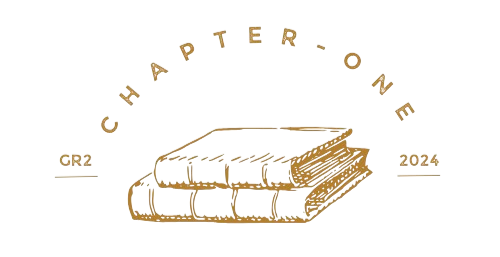

  

# 
**Escuela Politécnica Nacional**

 
 

### 
***Facultad de Ingeniería en Sistemas***

 

### 
***Ingeniería en Ciencias de la Computación***

 

### 
***Programación II***

 

  

### 
***Estandares de Codificación: Chapter Connect***

 

**GRUPO 2**

***Integrantes:***

- David Cuasquer 
- Alegria Farinango
- Celeste Gallardo

**Fecha de entrega:** 12/08/2024

**Docente:** Ing. Patricio Paccha 

 

#### 
***2024-A***

## Índice

1. [Propósito](#1-propósito)

2. [Destinatario](#2-destinatario)

3. [Plataforma Java](#3-plataforma-java)

  - [Buenas prácticas](#31-buenas-prácticas)

      - [Idioma](#idioma)

      - [Integración de bibliotecas](#integración-de-bibliotecas)
  
      - [Formato del código](#formato-del-código)

      - [Encapsulamiento](#encapsulamiento)

      - [Herencia, interfaz y clase abstracta](#herencia-interfaz-y-clase-abstracta)

      - [Sobreescritura y sobrecarga](#sobreescritura-y-sobrecarga)

      - [Manejo de excepciones](#manejo-de-excepciones)

      - [Interfaz gráfica](#interfaz-gráfica)

4. [Base de Datos](#4-base-de-datos)

   - [Plataforma de Almacenamiento](#plataforma-de-almacenamiento)

   - [Manejo de Base de Datos](#manejo-de-base-de-datos)

   - [Formato de Codificación](#formato-de-codificación)

   - [Comentarios y documentación](#comentarios-y-documentación)

   - [Uso de pausas](#uso-de-pausas)

   - [Versionamiento](#versionamiento)
  
5. [Referencias](#5-referencias)

 
 

## 1. Próposito 

Optimizar la gestión de inventario y ventas de una librería mediante la implementación de un sistema de lectura de códigos de barras, mejorando la eficiencia operativa y la experiencia del cliente

## 2. Destinatario 

Este documento está dirigido principalmente a los estudiantes universitarios que participan en el desarrollo del proyecto de clase sobre la implementación de un sistema de lectura de códigos de barras en una librería. Además, será de utilidad para cualquier persona interesada en la aplicación de tecnologías modernas para mejorar la eficiencia en negocios minoristas, especialmente en el sector de librerías 

## 3. Plataforma Java 

- **Buenas Prácticas** 
 
 - Idioma

- Integración de bibliotecas 

- Formato del código 

- Encapsulamiento

- Herencia, interfaz y clase abstracta

- Sobreescritura y sobrecarga 

- Manejo de excepciones 

- Interfaz Grafica 

## 4. Base de Datos 

- Plataforma de Almacenamiento

- Manejo de Base de Datos 

- Comentarios y documentación 

- Uso de Pausas

- Versionamiento 

## 5. Referencias 