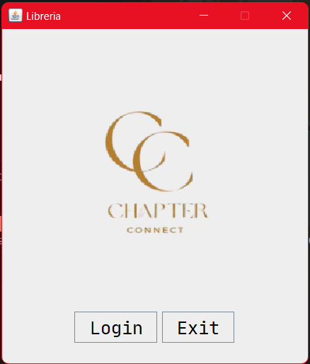
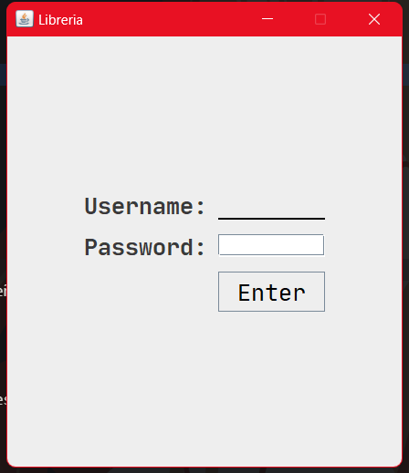
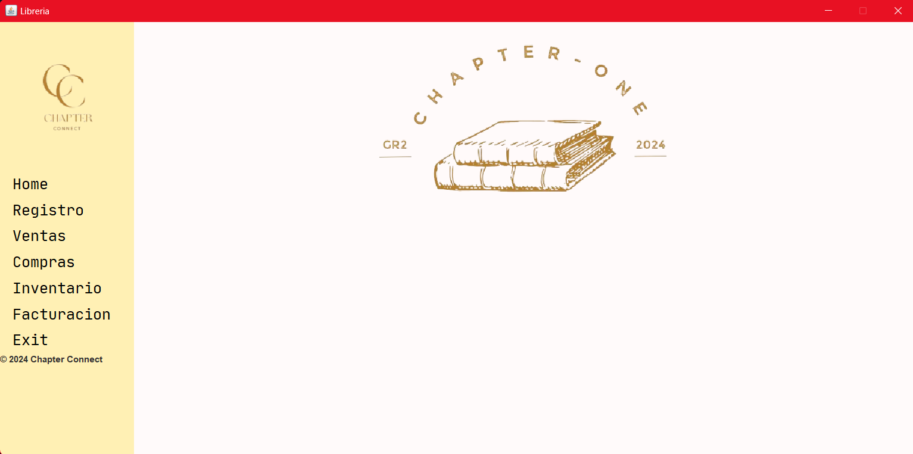
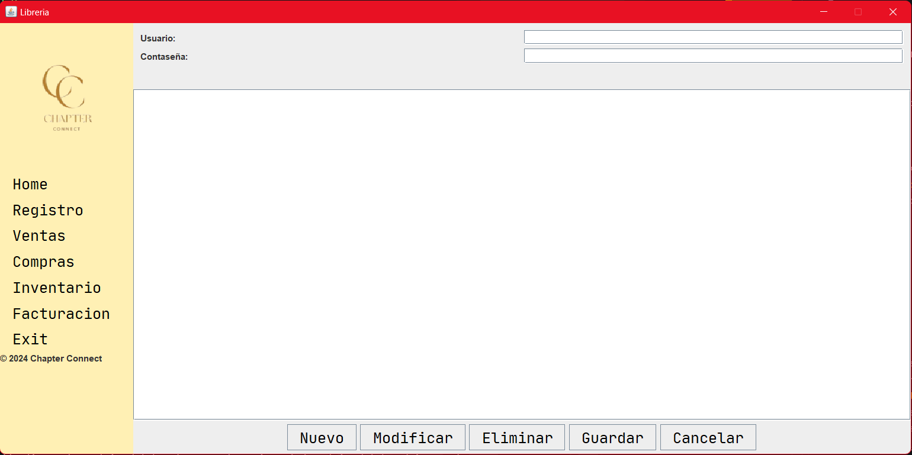
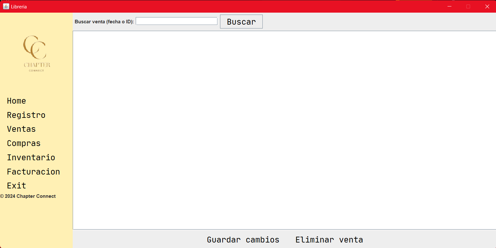
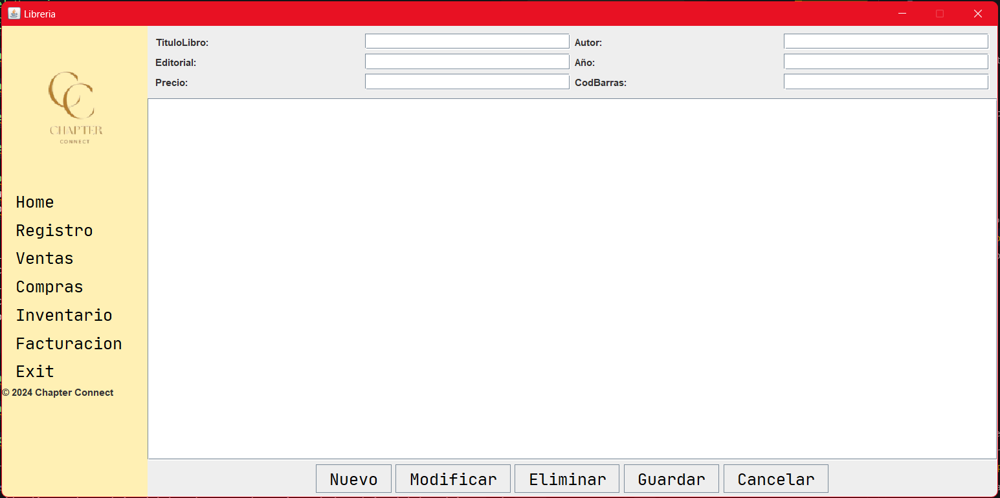
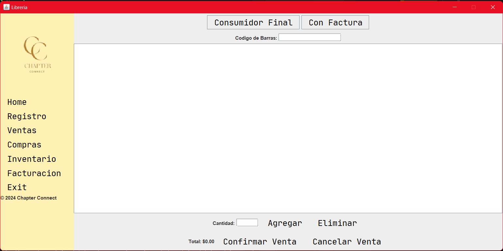
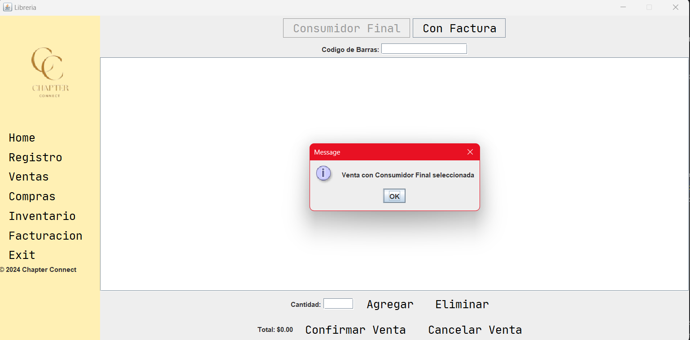

# Manual del Usuario

**GRUPO 2**

**Integrantes:**
- David Cuasquer
- Alegria Farinango
- Celeste Gallardo

**Fecha de entrega:** 12/08/2024

**Docente:** Ing. Patricio Paccha

## ***Índice de Contenido*** 
  -  **1. Introducción** 
  -  **2. Ingreso al Sistema** 
  -  **3. Pantalla de Inicio**
  -  **4. Registros**
  -  **5. Ventas**
  -  **6. Compras**
  -  **7. Inventario**
  -  **8. Facturación**
  -  **9. Exit**

### **1. Introducción** 
Bienvenido al Chapter Connect. Este software está diseñado para ayudar a administrar eficientemente una librería, incluyendo el inventario de libros, información de clientes, ventas, compras y facturas.

### **2. Ingreso al Sistema**
1. Abre la aplicación.

2. Haz clic en “Login”

3. En la pantalla de inicio, ingresa tu nombre de usuario y contraseña.
4. Haz clic en "Enter".

### **3. Pantalla de Inicio**
Después de iniciar sesión, verás el menú principal con las siguientes opciones:
- Registro
- Ventas
- Compras
- Inventario
- Facturación
- Exit

### **4. Registros**
- *Añadir un Nuevo Cliente*
1. Ve a "Registros" 
2. Completa los campos requeridos: Usuario, Contraseña.
3. Haz clic en "Guardar".

- *Modificar*
1. Ve a "Registros”
2. Ingresa el Usuario, Contraseña.
3. Haz clic en "Modificar".

- *Eliminar*
1. Ve a "Registros”
2. Ingresa el Usuario, Contraseña.
3. Haz clic en “Eliminar".

- *Cancelar*
1. Ve a “Registros”
2. Ingresa Usuario, Contraseña.
3. Haz clic en “Cancelar”.

### **5. Ventas**
-  *Realizar una Venta*
1. Ve a "Ventas".
2. Busca y selecciona el libro a vender.
3. Ingresa la cantidad.
4. Si el cliente está registrado, busca y selecciona al cliente.
5. Haz clic en "Añadir a la Venta".
6. Repite los pasos 2-5 para añadir más libros.
7. Haz clic en "Finalizar Venta".
8. Selecciona el método de pago y completa la transacción.

### **6. Compras**	
-  *Realizar una Compra*
1. Ve a "Compras”.
2. Busca y selecciona el libro a comprar.
3. Ingresa la cantidad.
4. Si el cliente está registrado, busca y selecciona al cliente.
5. Haz clic en "Añadir a la Comprar".
6. Repite los pasos 2-5 para añadir más libros.
7. Haz clic en "Finalizar Compra".
8. Selecciona el método de pago y completa la transacción.

### **7. Inventario**
- *Añadir un Nuevo Libro*
1. Ve a "Gestión de Libros" > "Añadir Libro".
2. Completa los campos requeridos: Título, Autor, ISBN, Precio, Cantidad en Stock.
3. Haz clic en "Guardar".

 - *Buscar un Libro*
1. Ve a "Gestión de Libros" > "Buscar Libro".
2. Ingresa el título, autor o ISBN en el campo de búsqueda.
3. Haz clic en "Buscar".

-  *Editar Información de un Libro*
1. Busca el libro que deseas editar.
2. Haz clic en "Editar" junto al libro.
3. Modifica los campos necesarios.
4. Haz clic en "Guardar Cambios".

-  *Eliminar un Libro*
1. Busca el libro que deseas eliminar.
2. Haz clic en "Eliminar" junto al libro.
3. Confirma la acción en la ventana emergente.

### **8. Facturación** 
- *Generar Factura*
1. Ve a "Factura".
2. Seleccionar:
  	- Consumidor Final.
	- Con Factura.

2.1. Consumidor Final
- Finaliza la compra.

2.2. Con Factura

- Ingresar Cliente.
- Haz clic en "Ok".
- Visualiza de la Factura y envió al correo electrónico.

### **9. Exit**
Salir del sistema
